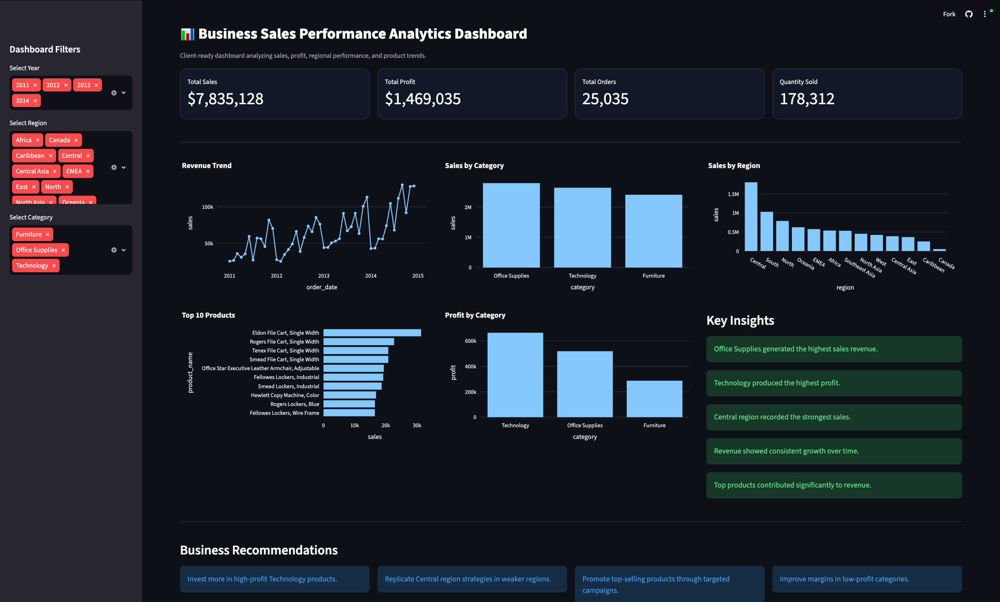
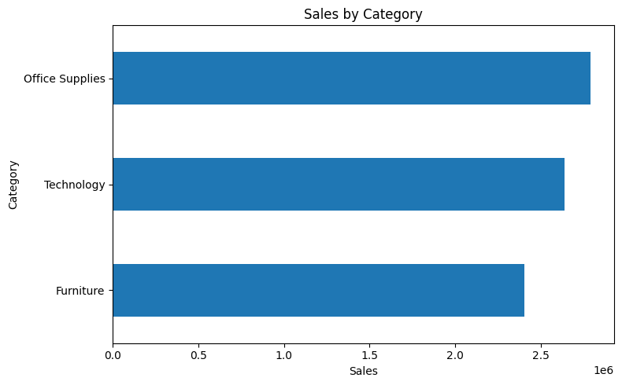
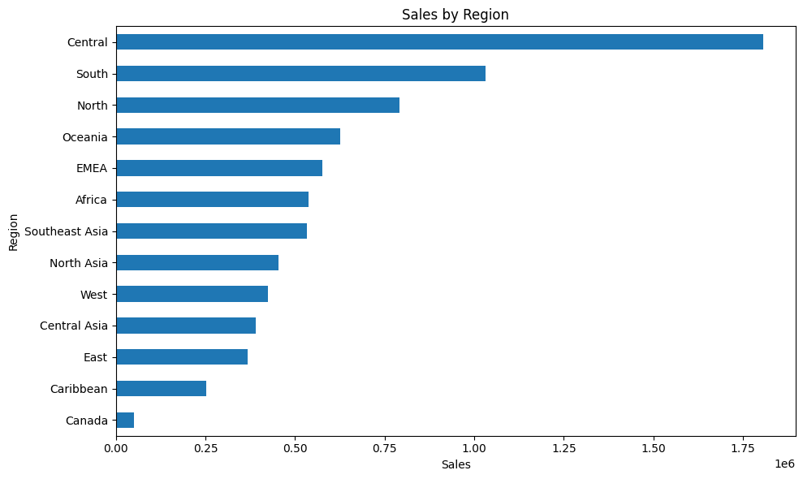
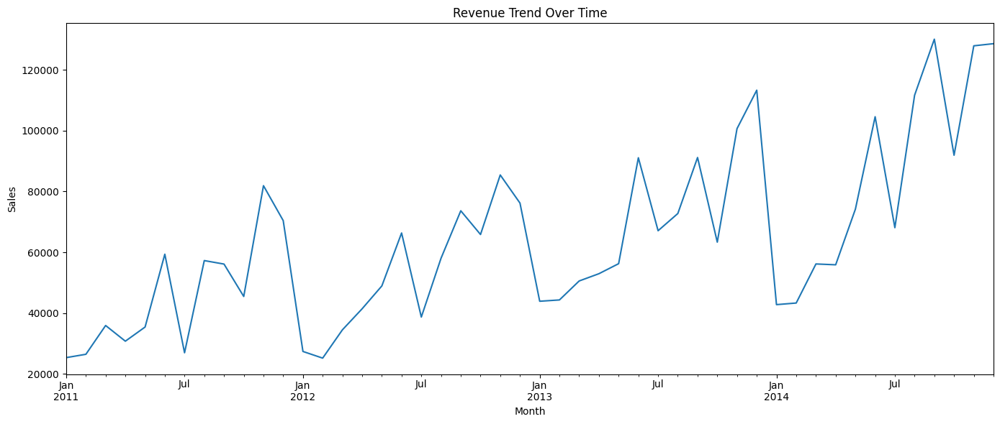
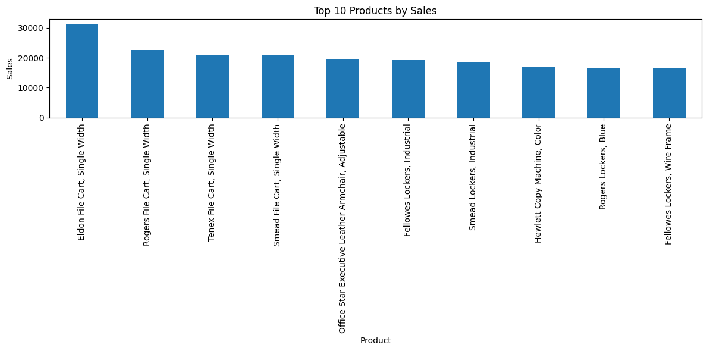
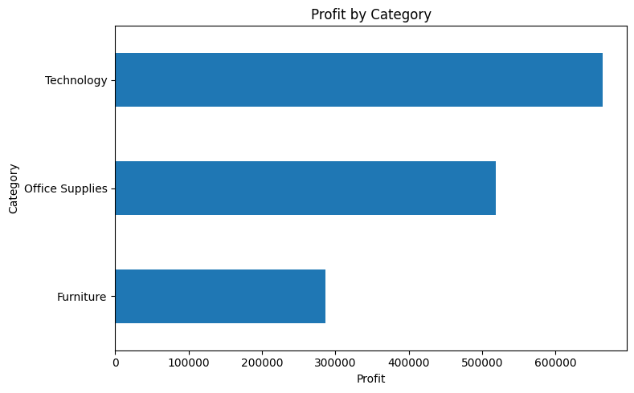
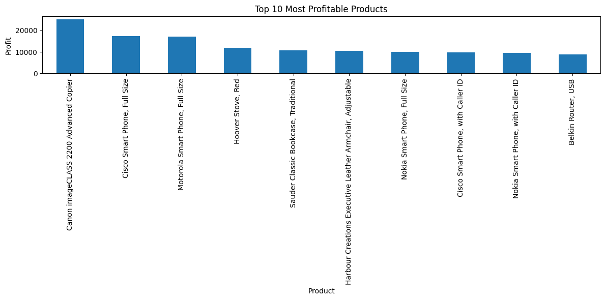

# Business Sales Performance Analytics

## Overview

This project was completed as part of the Future Interns Data Science & Analytics Internship Program (Task 1).

The objective of this project is to analyze business sales data and identify revenue trends, top-performing products, profitable categories, and regional sales performance. The analysis aims to provide actionable business insights and recommendations that can support strategic decision-making.

---

## Dataset

**Dataset Used:** Superstore Sales Dataset

The dataset contains information related to:

- Orders
- Products
- Categories
- Regions
- Sales
- Profit
- Quantity
- Discounts
- Shipping Costs

---

## Objectives

- Analyze sales performance over time
- Identify top-selling products
- Evaluate category-wise sales and profitability
- Compare regional performance
- Generate business insights and recommendations

---

## Tools Used

- Python
- Pandas
- Matplotlib
- Plotly
- Streamlit
- Kaggle Notebook
- GitHub

---

## Live Dashboard

Dashboard Link:

https://futureds01-cfyyrnlmqi4wyy9mt3udhu.streamlit.app

### Dashboard Preview

---

# Analysis Performed

## Dashboard Visualizations

  
  
  

  
  

  

-- 

# Key Findings

- Office Supplies generated the highest sales revenue.
- Technology generated the highest profit.
- The Central region recorded the highest sales performance.
- Revenue demonstrated a positive growth trend between 2011 and 2014.
- A small number of products contributed significantly to overall sales and profitability.

---

# Business Recommendations

1. Increase investment in high-profit Technology products.
2. Replicate successful sales strategies used in the Central region.
3. Promote top-selling products through targeted campaigns.
4. Optimize lower-performing categories to improve profitability.
5. Focus on high-margin products to maximize business growth.

---

# Conclusion

This analysis provides valuable insights into business performance and highlights opportunities for revenue growth, profitability improvement, and strategic expansion.

---

## Author

**Jyotish N**

Future Interns – Data Science & Analytics Internship Program

GitHub Repository:

https://github.com/Jyo-08/FUTURE_DS_01

Live Dashboard:

https://futureds01-cfyyrnlmqi4wyy9mt3udhu.streamlit.app
